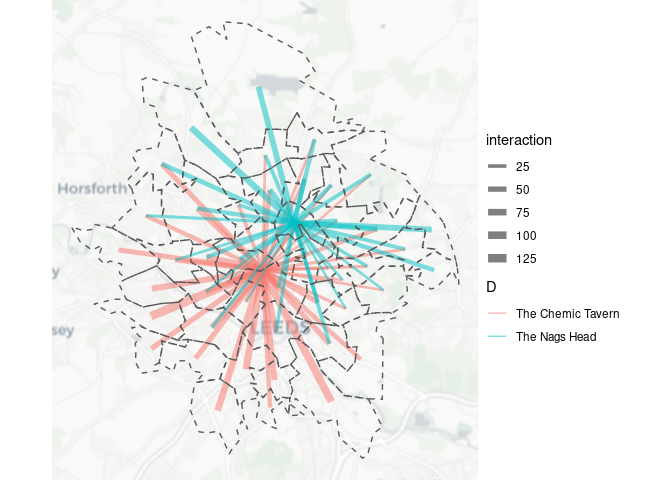

<!-- README.md is generated from README.Rmd. Please edit that file -->
<!-- # Spatial Interaction Modelling Chapter -->

# 1 Definition and Uses

For over 70 years, spatial interaction models (SIMs) have been a key
tool to simulate flows between entities at different locations in
physical space. SIMs represent mathematical formulations through which
the spatial interaction between geographic places encoded in aggregate
flows of people, information and goods can be rendered. Intuitively,
these models seek to represent the spatial interaction between places as
a function of three components: origin characteristics, destination
characteristics and the separation between origins and destinations.
Originally adapted from physics, spatial flows between an origin and a
destination were conceived to be proportional to their gravitational
force and inversely related to their spatial separation. Characteristics
of origins and destinations are used to represent gravitational forces
pushing and/or pulling people, information and goods from and to
specific locations, and different forms of distance and costs are used
to represent the deterring effects of geographical separation on spatial
flows.

SIMs have been applied in a wide range of contexts to support data
analysis and decision making in retail, transport, housing,
epidemiology, public health, land use, urban and population modelling
and planning projection and forecasting contexts. SIMs are generally
used for two key purposes: prediction and inference. The *prediction* of
the size and direction of spatial flows has been used to predict the
impact of new service units, such as shopping stores, healthcare
facilities and housing units on the potential demand for associated
services and traffic patterns. Predictions from such analyses enable the
identification of optimal locations and size for potential new service
units. A second key purpose of SIMs is *inference* about the factors
shaping the spatial interactions in a network of flows. SIMs have been
used to determine and understand the influence of retail store on
consumers’ store choices and place attributes on migration decisions and
commuting patterns. SIMs have also been used to delineate geographical
areas of service and retail catchment areas.

Formally SIMs take different forms. Newtonian gravity models are
probably the most widely known and used form of spatial interaction
models in social sciences. Adapted from physics, the basic gravity model
assumes that the interactions

between an origin

and a destination

in the form of flows can be understood as a function of driving forces
like masses

and

, and a measure of spatial separation

. Areas are assumed to interact in a positively reinforcing way that is
multiplicative of their masses, and at the same time their interactions
are expected to diminish with the intervening role of spatial
separation. Spatial separation is generally measured by distance, cost
or time involved in the interaction, and is often represented by a
distance-decay function. In human systems the model generally also
incorporates a

constant ensuring that expected flows do not exceed observed totals, and

parameter representing the deterring effect of spatial separation, or
distance. The key task in a gravity model is to estimate these
parameters
(i.e. 
and

). A typical notation for the model is:


In practice, a matrix of flows, between a set of origins, a set of
destinations and a measure of spatial separation between origins and
destinations, is the key input for SIMs. A family of SIMs encapsulating
four distinctive shapes is typically considered (Wilson 1971). An
*unconstrained* formulation of the model is actually constrained to
ensure that the total sum of the predicted flows from a gravity model be
equal the total sum of the observed flows across all origins and
destinations. *Constrained* versions are used to ensure that specific
origin or destination observations are met. Three general formulations
of constrained models are used: production-constrained,
attraction-constrained and doubly constrained models.
*Production-constrained* forms are used to constrain a model so that the
predicted number of trips emanating from each origin is equal to the
observed number of trips. *Attraction-constrained* forms do the same but
at the destination. *Doubly constrained* models combine these two sets
of constraints.

SIMs have been extended in six key ways. First, social science theory
has been infused to underpin and enrich SIMs. SIMs were originally
conceptualised as a mathematical formulation to represent observed
relationships between origins and destinations encoded in a
origin-destination matrix, and generate accurate prediction of spatial
flows. Field-specific theories have been used to extend and develop the
fundamental structure of SIMs to understand retail, trade, transport,
communication, migration and mobility patterns. Second, more
sophisticated measures to capture the influence of origins and
destinations have been developed. The specification of SIMs has moved
away from relying on population size to approximate the propulsive
effect of origins and attractive force of destinations, to capture local
economic, political, cultural and social differences across origins and
destination, and recognise propulsive and attractive effects at play in
both origins and destinations. Third, measures of spatial separation
have also been refined to more appropriately reflect the geographical,
physiological and financial distance and costs between origins and
destinations (Schwartz 1973). It is now much easier to calculate route
distances on road networks thanks to routing engines and interfaces to
routing engines from languages in which SIMs can be developed Morgan et
al. (2019). Many innovations are possible thanks to new datasets, for
example the use of night-time light intensity to estimate the spatial
distribution of human settlements (Niedomysl et al. 2017), and the use
of aggregated datasets derived from social media sources to train SIMs
(Lovelace et al. 2014). Fourth, considerable methodological work has
been done to conceptualise and operationalise the influence of spatial
structure in SIMs (Oshan 2021). Fifth, generalisable approaches have
been proposed to account for spatial structure in distinctive ways: the
competing destination model by including an accessibility measure (A. S.
Fotheringham 1983); the Box–Cox transform by using a Box–Cox functional
form of distance


; spatial choice modelling by accounting for destination alternative
substitution patterns (Hunt, Boots, and Kanaroglou 2004); spatial
econometric modelling


; and eigenvector spatial filtering by incorporating spatial dependence
or spatial autocorrelation


. Fifth, frameworks to calibrate SIMs have evolved. Early methods of
calibration comprised linear programming and non-linear optimization.
Regression methods have now become prominent evolving from linear
log-normal model formulations using ordinary least squares (OLS) and
maximum likelihood estimation procedures, through generalised linear
frameworks using iteratively reweighted least squares (IWLS), especially
Poisson and Negative Binomial distributions


, to more sophisticated multilevel and discrete choice models to capture
origin-, destination- or origin-destination-specific parameters


. Sixth, alternative frameworks of spatial interaction modelling have
been developed to incorporate different ways of conceptualising the
decision-making process of choosing a destination location. The
radiation (Simini et al. 2012), exploration and preferential return
(Pappalardo et al. 2015) and random utility models (McFadden 1974) have
become prominent frameworks to model spatial flows, particularly human
mobility flows.

Thus, considerable progress has been made on advancing the theoretical
and methodological underpinnings of SIMs. Yet, major challenges remain
in terms of reproducibility, calibration and *Big Data* modelling. We
believe that addressing these challenges are key to facilitate the
application of SIMs, extend existing modelling approaches, leverage the
greater geographical and temporal breadth, depth, scale and timeliness
of *Big Data* and ultimately enhance our understanding human
interactions and our social world.

# 2 Challenges

In this section, we want to describe why the areas identified are seen
as challenges and in which ways.

## 2.1 Reproducibility

Reproducibility of SIMs has not been a prominent area of attention in
past research. Replicating most SIM application would certainly be a
challenge. Such situation is unfortunate as it is likely to have limited
the applicability and portability of sophisticated frameworks to
estimate SIMs and capture the effects of spatial structure on spatial
flows. In fact many sophisticated SIMs have been developed to capture
the effects of spatial structure on spatial flows, but the accessibility
and applicability of such models remained limited. Arguably even the
application of basic formulations of SIMs tends to represent a daunting
challenge for beginning modelers of spatial flow data. The lack of
reproducibility as a standard research practice has tended to generate
“black box” data analyses, preventing the validation, verification and
comparability of SIM estimates.

Understandably, reproducibility was not concern during the 1970s and
1980s, when significant progress was made on developing SIMs. Computer
hardware, software and know-how needed to develop and deploy SIMs were
unavailable to most people. Even when consumer laptops became widely
available and more affordable during the 2000s, few well-known
user-friendly off-the-shelf options to implement SIMs existed. Yet,
today, computer software and hardware are highly affordable and learning
computing programming has become increasingly accessible. With the
advent of open science, resources to learn computer programming in
popular data science languages, such as *R* and *Python* have become
widely available. Nevertheless, most SIM applications cannot still be
reproduced.

Yet, reproducibility of SIM estimates can yield key benefits for future
research, impact and training . Reproducible research can boots
citations and facilitate comparability of research results enabling the
application of existing methods to a wide range of contexts (Brunsdon
2016). Reproducibility can also enhance accountability, validation and
verification of research findings by increasing transparency Brunsdon
(2016). By transparently sharing open data products, including
reproducible code and input data (Arribas-Bel et al. 2021), used in the
analysis, results can be validated and lessons can be learnt from the
limitations and strengths of the application of particular methods.
Reproducible open products can also increase the portability of existing
work. New research can build on existing code and data focusing on
addressing new novel questions, and avoiding reinvention of wheels and
associated waste of time. Reproducible work can facilitate the
generation of updates as new data become available. Reproducible open
data products can also be used as communication and impact strategy
expanding the original purpose of research findings (Nüst and Pebesma
2021). Reproducible code and data can be used to provide educational
training and enable practitioners to address policy questions which were
not outside the scope of the original research project (Rowe et al.
2020).

## 2.2 Calibration

Calibration is at the centre of what makes spatial interaction models
useful to researchers and practitioners. As (Openshaw 1975) describes
it, “calibration is the process of providing estimates of the unknown
parameters we have identified as the independent variables of the
model.” In a basic gravity SIM formulation, we seek to estimate three
parameters - as identified above - relating to origin mass, destination
mass and a parameter determining the frictional effect of spatial
separation between origins and destinations. These parameters reveal
information about our system of interest - for example, how costly
physical separation distances are to interaction.

Yet, we identified key challenges relating to the calibration of SIMs.
Calibration requires both data and software. Forty or fifty years ago
when many of the theoretical foundations of spatial interaction
modelling were laid, the data landscape was somewhat different from
today – spatial flow data were rarely available in volume and certainly
not at the sort of temporal rhythm they are now where, for example,
supermarket loyalty-card holders generate origin/destination revenue
flow data from residential origins to store destinations at daily
frequencies over time periods than can cover many years or even decades.
As such, we might be forgiven for expecting that even if the science and
theory underpinning the models has not developed very much, the software
and processes facilitating calibration – relating empirical observations
to the theoretical representations embodied in the models – might have.
But in many ways, they have not. Today spatial flow data are ubiquitous.
They can be derived from digital traces collected across various sensor
networks involving mobile phones, social media, loyalty cards, smart
card tickets and credit cards. Accessing interaction data is thus not
the barrier it once was.

Yet, making sense of these data – understanding where commuting flows
are unexpected, or differences in customer profiles shopping at similar
retail stores – remains a challenge. Much of the challenge is because
there is a dearth of knowledge within geographical education. Despite
SIMs underpinning many social and geographical processes, these models
are not taught to undergraduate geography students in the same way as,
say, regression models are taught to economists or social psychologists.
As such, it is not immediately obvious, even for those with geography
degrees, how anyone might go about fitting their spatial flow data to a
theoretical model, calibrating the parameters and revealing properties
of their system. But, why have cohorts of undergraduate geography
students not been taught how to fit these models and explore systems of
spatial interaction?

Accessibility seems to represent an obstacle for the wider applicability
of SIMs. We discussed issues around reproducibility challenging the
practical application of SIMs, but that with packages like `SPINT`
(Oshan 2016) and our own efforts with the `simodels` package in *R* (see
Section <a href="#enabling-infrastructure">3.1</a>, the tide is
beginning to turn. Yet, calibration remains a challenging sub-topic for
reproducibility and wider accessibility of these models, particularly
where algorithms which are able to calibrate parameters have remained
locked away - either behind dense algebraic notation in dusty papers
from the 1970s, or where they have found their way into commercial
software, behind paywalls.

Ironically, effective enough calibration routines have been available
for as long as students have been running regression models in their
introductory statistics classes. Occasional references can be found in
the historic literature (e.g. (A. Stewart Fotheringham and Webber 1980);
(Flowerdew and Aitkin 1982)) which lift the curtain and reveal that
through reformulating the classic Wilsonian entropy maximising spatial
interaction model as either a logged OLS regression model or a GLM
utilising Poisson or negative binomial distributions, multiple
parameters can be calibrated easily. These models are all available in
common statistical software packages; but for most trying to make sense
of the field coming across papers by some of the doyens (for it was and
still is a male-dominated field) of the scene, practical expediency is
often sacrificed at the alter of theoretical or technical prowess. And
even then, while undoubtedly mathematically and theoretically rigorous,
notes on calibration can be presented either as passing reference to
‘least squares’ or worse a lengthy derivation of maximum likelihood or
Newton Raphson methods with no practical middle ground to assist novices
in running a model.

## 2.3 Big Data modelling <!--# 450 words -->

As argued above, new technologies have enabled the emergence of ‘Big
Data’ through the production and storage of large volumes of digital
data. Much of these data contain location information and hence offer an
opportunity to derive spatial flow data and understand spatial
interactions between places. Big Data offer unique opportunities to
study spatial interactions at unprecedented detailed geographical and
temporal scales in real or near real-time across extensive populations
and geographical areas. However, leveraging on these opportunities also
involves major challenges for the analysis and modelling of spatial
interactions (Rowe 2021). Furthermore, Big Data sources have often
analysed ‘as-is’, without due attention paid to levels of validity and
cross-comparison between data sources. Validation techniques and
model/aggregate-data comparisons can help overcome these issues
(Lovelace et al. 2016).

Limited research has focused on explicitly capturing patterns of
non-stationarity in spatial interaction modelling despite the
availability of suitable methods (Oshan 2021). While the issues of
calibration discussed in Section <a href="#calibration">2.2</a> may have
represented a barrier, lack of large enough data sets may have also
hindered progress. Before the emergence of Big Data, the most common
form of spatial flow data were cross-sections of origin-destination
matrices derived from censuses or surveys, offering information at
coarse geographical scales and population subgroups. The rise of data
now offers more granular and denser volumes of data to capture patterns
of spatial, temporal and population non-stationarity. The adoption and
adaption of more sophisticated modelling frameworks will thus be
required to effectively model these patterns.

Big Data also represent challenges for statistical inference. An
standard practice in social sciences is to be guided by *P* values.
Regression model estimates with *P* values below 0.05 threshold are
commonly considered statistically significant and thus these estimates
take central stage in most analyses. Modelling estimates derived from
large data sets, however, often render *P* values below this threshold,
calling for the adoption of alternative approaches. Such situation
aligns with more general calls for a stop to the use of P values in the
conventional, dichotomous way - to decide whether a result supports or
refutes a scientific hypothesis. Additionally, Big Data offer an
opportunity to embrace causal inference approaches. Reliance on
cross-sectional data hindered the wide adoption of causal inference
approaches to study the determinants of spatial interactions. Big Data
now provides large, detailed longitudinal data sets to track spatial
interactions and establish cause-and-effect relationships. Obtaining
suitable time-varying data on relevant factors believed to shape the
dynamics of spatial interactions may remain an obstacle. While data may
be available, spatial integration of data may not be possible because of
ethical considerations and data governance issues.

New methods are also required to handle, analyse and store large data
sets. Traditional SIM frameworks were designed to identify significant
relationships in small sample sizes with known properties. Big data are
not collected for research purposes. They are an unintended consequence
of administrative processes or social interactions and need to be
reengineered for research. Handling Big Data requires a wider and new
digital skills set, largely based on machine learning and artificial
intelligence (ML/AI) and coding, in addition to greater knowledge of
computing technology (e.g. Jupyter notebooks, Github and Docker) as well
as scalability and parallelisation approaches. Except for a few centres,
current university geography programmes and infrastructures are largely
unprepared to deliver the required training. A multidisciplinary
approach is needed to integrate computational training into human
geography. ML/AI are likely to enhance prediction outcomes generated
from SIMs. The idea of using ML/AI to model spatial interactions is not
new, but the application has been limited due to the lack of large data
sets. ML/AI are data hungry, requiring millions of data for effective
training and validation. The rise of data provide an opportunity to
promote the wider adoption of these models.

# 3 The Way Forward

This section will describe the areas which should be developed to
address the identified challenges.

## 3.1 Enabling Infrastructure <!--# 450 words -->

Developing the essential infrastructure is key to enhance the
reproducibility and facilitate the calibration of SIMs. Software, open
science and digital technology (i.e. computational notebooks and Docker)
are important elements to develop an ecosystem that fosters reproducible
SIMs, provides adequate training and facilitate the application of SIMs.
We believe that an essential building block in this ecosystem is
user-friendly, efficient, open source software. Partly motivated by this
chapter, we have developed the `simodels`[^1] *R* package (Lovelace and
Nowosad 2022). [^2] Below we present a reproducible example . `simodels`
enables the rapid develop of SIMs — starting from basic geographic
datasets as the key input — in comparatively few lines of code .

`simodels` does not just provide functions for running and fitting
(finding parameters to minimise model-observation differences). It
provides a framework for developing SIMs and creating new functions
implementing different types of SIM and using a variety of pre-existing
modelling tools in SIMs. We aim to expand the functionality of the
package building on the foundations presented below.

The first step to using the package and reproducing the minimal results
shown below is to install R and an appropriate integrated development
environment such as RStudio. After starting RStudio for the first time,
you can get started with SIMs in a statistical programming environment
that has strong support geographic visualisation (as we will see in the
visualisations in this section) and modelling capabilities. The first
step in this reproducible example is to install the package by entering
and running the following command into the R console:

``` r
install.packages("simodels")
```

We will also install `tidyverse` for intuitive data processing
functionality (Grolemund and Wickham 2016). Load the packages as
follows:

``` r
install.packages("tidyverse")
```

``` r
library(simodels)
library(tidyverse)
```

The starting ‘point’ is geographic entities representing trip start, end
(for ‘multi-partite’ models) or intermediate points. We use the word
‘features’
<!--# FR: would be good to clarify what features is used for....geographic entities? -->
because almost all SIMs use input data sets that are compliant
<!--# FR: It would be good to clarify what "are compliant with the simple feature specification" means. Does the statement that follows explain it? -->
with the ‘simple features’ open specification ((OGC) Open Geospatial
Consortium Inc 2011), typically imported from files encoded in
proprietary the Shapefile (`.shp`) or open GeoPackage (`.gpkg`), GeoJSON
(`.geojson`) or other geographic file formats. *R* has a mature
ecosystem for working with geographic file formats, so we can use the
`sf` package:

``` r
u_origins = "origin_zones.geojson"
f_origins = basename(u_origins)
u_destinations = "destination_points.geojson"
f_destinations = basename(u_destinations)
```

``` r
download.file(u_origins, destfile = f_origins)
download.file(u_destinations, destfile = f_destinations)
```

``` r
origin_zones = sf::read_sf("origin_zones.geojson")
destination_points = sf::read_sf("destination_points.geojson")
```

The code chunk above demonstrates importing specific data objects
<!--# FR: It may be a good idea to explain the structure of the input spatial flow data as to whether the `simodels` requires a data file organised in a certain way i.e. origin-destination matrix format or can handle alternative structures ie. long data formats with origin-destination pairs as rows.  -->: 1)
a simple features object with ‘multipolygon’ geometries representing
administrative zones that constitute trip origins; and, 2) a simple
features object with ‘point’ geometries representing two popular pubs in
Leeds as trip destinations. Before creating SIMs representing travel to
these two pubs in Leeds, we first perform some exploratory data analysis
(EDA) to illustrate the input data.

``` r
origin_zones %>% 
  ggplot() +
  geom_histogram(aes(x = to_pubs), binwidth = 10)
origin_zones %>% 
  ggplot() +
  geom_sf(aes(fill = to_pubs), alpha = 0.5) +
  geom_sf(data = destination_points)
```


For many applications, the most important function in the `simodels`
package is `si_to_od()`:

``` r
od_zones_to_points = si_to_od(origin_zones, destination_points)
class(od_zones_to_points)
nrow(od_zones_to_points)
names(od_zones_to_points)
```

As shown in the output above, the result is a data frame with 94 rows,
representing the full combination of trips from each of the 47 origin
zones to each of the 2 destinations. The names in the data frame refer
to variables for origin and destination locations. When working on large
input data sets, the ‘full matrix’ of combinations can get unhelpfully
large: an OD dataset from every MSOA to every pub in England, for
example, would results in a data set with 350,000,000 (350 million)
rows. To reduce data set sizes, a ‘sparse matrix’ representing only OD
pairs below a certain distance threshold can be created by adding a
`max_dist` argument as shown below. The maximum Euclidean distance
between zone centroids and point destinations needs to be set, at 5 km
in this example. Note \`si_to_od\` will expect Euclidean distance to be
provided in the origin-destination data set.

``` r
od_zones_to_points = si_to_od(origin_zones, 
                              destination_points, 
                              max_dist = 5000)
```

The resulting origin-destination data set is smaller (79 rows compared
with 94 rows previously). While in the existing example this does lead
to a major reduction, this process can greatly speed-up SIM processing,
modelling and visualisation run times dealing with large data sets.

We can now specify a simple SIM model as follows:

``` r
gravity_model = function(beta, d, m, n) {
  m * n * exp(-beta * d / 1000)
} 
```

and implement it with the following command:

``` r
od_to_pubs_result = od_zones_to_points %>% 
  si_calculate(fun = gravity_model, 
               m = origin_to_pubs,
               n = destination_size,
               d = distance_euclidean,
               beta = 0.5,
               constraint_production = origin_to_pubs)
```

We can check the results:

``` r
sum(od_to_pubs_result$interaction)
#> [1] 2903
sum(origin_zones$to_pubs)
#> [1] 2903
```

As shown above, the total number of trips is the same in the OD data as
in the zone level data. We can visualise the result as follows,
resulting in Figure <a href="#fig:pubresmap"><strong>??</strong></a>:

``` r
library(ggspatial)
# rosm::osm.types()
od_to_pubs_result %>% 
  ggplot() +
  annotation_map_tile(type = "cartolight") +
  geom_sf(aes(lwd = interaction, colour = D), alpha = 0.5) +
  scale_size_continuous(range = c(0.3, 3)) +
  geom_sf(data = origin_zones, fill = NA, lty = 2, alpha = 0.5) +
  theme_void()
```



<!--# FR: would be good to include a comment to close the section - perhaps on how we see the package being developed or suggest that the next sections provide this vision -->

## 3.2 Capturing Heterogeneity

We argue that research on SIMs should seek to adopt and adapt modelling
frameworks to capture and understand patterns of spatial, temporal and
population non-stationarity which can now be capture given the rise of
large data sets. This line of enquiry involves calibrating models to
estimate separate parameters for individual origins, destinations, time
units and population segments. Such parameters can reflect local,
temporal and population variations in the relationships producing
spatial flows. Inference based on a set of global model parameters may
lead to draw misleading conclusions due to misrepresentations of local-,
temporal- and population-specific trends.

Yet, as noted above, limited progress has been made on capturing these
patterns of non-stationarity (Oshan 2021). Existing approaches have been
proposed to capture spatial-nonstationarity. An approach involves
subsetting the overall data set into origin- or destination-specific
data sets and calibrate individual models for each data set. An
alternative approach is to include interaction terms between a binary
categorical variable identifying an origin or destination, and each of
the relevant covariates in a regression model. A third alternative is to
use geographically weighted regressions (GWRs) to capture spatial
non-stationarity (Graells-Garrido et al. 2021), but the extension of
these models to calibrate spatial flow count data is challenging. It
often requires the log transformation of spatial flows. Yet, such
approaches may be inappropriate when dealing with sparse
origin-destination matrices containing zeros. In such scenarios, using
appropriate count distributions is recommended (O’Hara and Kotze 2010).

We propose generalised linear mixed models (GLMMs) as a more flexible
modelling framework to capture all three sources of non-stationarity
based on appropriate count data distributions. GLMMs extend GLMs to
incorporate a combination of random and fixed effects parameters as
predictor variables, and accommodate non-continuous responses, such as
binary and count responses. Fixed effects represent a typical covariate
and are typically used to capture “global” average patterns. Random
effects are represented by categorical variables encoding some grouping
unit, and can be used to estimate the extent of variations between and
within groping units. Random effects are flexible, and in SIMs, units
could comprise groups or individual origins, destinations,
origin-destination pairs, time intervals or population subgroups to
capture spatial, temporal and population variations in spatial flows.
Unlike GWRs, the flexibility of GLMMs provides an opportunity
selectively capture patterns of non-stationarity in relationships with a
selected group of theoretically- or policy-relevant variables. In
addition to flexibility, random effects can aid to correct statistical
inference about fixed “global” effects by providing an estimation of
variable in the response variables within and between groups. They can
also reduce the probability of Type I error and Type I error (Harrison
et al. 2018). GLMMs can also be used to explicitly model spatial and
temporal auto-correlation.

Yet, challenges exist in applying GLMMs. First, GLMMs make additional
assumptions about the data to those made in standard statistical
approaches and they need to be tested


. Second, interpreting the model outputs from GLMMs correctly may be
challenging, particularly estimates relating to variance components of
random effects and correlations. Third, model selection is a challenge
because of biases in model performance tests caused by the presence of
random effects


. Guidelines for the implementation of GLMMs will therefore be needed to
navegate these challenges and leverage the potential of these models to
effectively account for non-stationarity in spatial flows.

## 3.3 Enhancing Statistical Inference

We argue new ways of approaching statistical inference in SIMs. First,
we call for a careful use of the concept of statistical significance. As
highlighted in Section <a href="#big-data-modelling">2.3</a>,
dichotomising estimates into ‘statistically significant’ and
‘statistically non-significant’ is unhelpful and can lead to draw
misleading conclusions, particularly for models relying on large data
sets as the full set of estimates in such models can render *P* values
below 0.05. An approach is embracing uncertainty, and re-conceptualing
confidence intervals as ‘compatibility intervals’ can provide a
practical solution (Amrhein, Greenland, and McShane 2019). This shifts
the focus to all values inside the interval and to the fact that
singling out a single point estimate may not be appropriate to draw
broad conclusions about the factors underpining spatial flows.

Second, we argue for greater use of causal inferential approaches. Big
Data now offers an unprecedented temporal frequency to capture spatial
interactions in very short time frames, and understand the sequence of
events to distinguish causes and consequences of these interactions.
Identifying these causal-effect relationships is key to understand the
impact of interventions and inform the development of policies aiming at
generating a desired outcome. Inference statistical approaches are
widely used in other social science disciplines, but these practices
have not permeated through geography. Causal inference on spatial
processes faces additional challenges, such as spatial dependence,
spatial heterogeneity and spatial effects (Akbari, Winter, and Tomko
2021). So, while adopting causal inference methods to analyse spatial
interactions may not be straightforward, we believe that is a valuable
endeavor to inform the design of future policy interventions.

Third, we propose the use of multi-model inference. Intuitively,
multi-model inference seeks to draw conclusions from a range of
theoretically-sound model specifications (Burnham and Anderson 2004). It
uses model averaging to determine the direction and strength of
regression predictors, and enables the generation of Akaike Information
Criterion based weights from multiple models to assess the relative
importance of predictors in an outcome. As such, inferences are not
drawn from a single model, leading to more robust inferences, and offers
an alternative approach to evaluate the importance of predictors that
does not depend on statistical significance dicothomy. Additionally
determining the relevance of factors shaping spatial flows based on
multi-model inference offers an additional alternative to make inference
in the context of SIMs and Big Data. Multi-model inference has been
rarely applied to capture spatial interactions (Rowe 2013). Yet, it is
widely used in biology and ecology, and various routines exist in *R*
which can be integrated with `simodels`.

## 3.4 Integrating Data Science

New methods and tools are needed to engineer and calibrate SIMs using
large data sets. In agreement with Singleton and Arribas-Bel (2019), we
recognise that the value of data science approaches to enable the
calibration of SIMs on large data sets. We propose that data science can
be beneficial on three key fronts. First, a key challenge is the
storage, manipulation and analysis of large volumes of data. Large data
sets cannot generally be stored and analysed on a computer’s local
memory. Traditional approaches relying on local memory capacity to
calibrate SIMs are therefore sub-optimal. Adoption of data science
approaches to Big Data storage, scalability, high performance computing
and parallel computing. Training and infrastructure to integrate these
approaches are needed to enable researchers to unlock the opportunities
afforded by Big Data, understanding spatial interactions in real-time or
near real-time at more detailed temporal and spatial granularity.

Second, we propose the use of ML/AI to enhance the prediction capacity
of SIMs. While this proposal is not new and ML/AI approaches have been
deployed mainly in transport applications, their deployment in geography
has been limited. Big Data now provides enough density of data to train
and assess the capability of these algorithms to predict spatial
interactions. Emerging evidence suggests that ML-calibrated SIMs
outperform traditional GLM-calibrated SIMs at generated more accurate
predictions of spatial interactions (Rowe, Mahony, and Tao 2022). ML/AI
models do not require a pre-defined functional specification. They have
the ability to uncover complex structure in the data and are rapidly
deployable requiring limited human intervention. In the context of SIMs,
the promise is that ML/AI can uncover and accommodate complex functional
forms capturing patterns of spatial and temporal dependence and
non-stationarity (Rowe, Mahony, and Tao 2022).

Third, ML/AI are also expected to enhance causal inference in SIMs.
ML/AI-based methods are generally focused on prediction rather than
understanding and establishing causal relationships. Yet, ML/AI models
can be combined with causal inference to enhance the identification of
cause-and-effect relationships. Many causal methods use prediction to
generate instruments or counterfactuals in a first stage that can be
employed in a second phase to produce “more” reliable estimates for
statistical inference. Thus the fundamental problem of causal inference
is the existence of a perfect analogue of out-of-sample performance for
causal models, since counterfactual quantities are never observed. ML/AI
models can be used to derive “better” counterfactuals and enhance
inference on causality. At the same time, ML/AI can help scale causal
effect estimation methods to SIMs based on high-dimensional data and
unstructured data. ML/AI thus offers an opportunity to build accurate
decision-support systems that estimate effect of interventions on
spatial flows.

# 4 The future of spatial interaction modelling

SIMs represent a core analytical tool to predict and understand spatial
flows of people, information and products across our society and
economy. Ultimately SIMs provide essential knowledge and information to
support decision making and policy interventions. During the COVID-19
pandemic alone, SIMs have been essential generating critical evidence to
monitor the geographical extent and speed of infection spread, retail,
transport and movement activity by understanding human spatial
interactions. Despite considerable progress over the past fifty years,
we identified key challenges for the efficient deployment of SIMs in
terms of reproducibility, calibration and Big Data modelling. We
identified four areas of future development to tackle these challenges:
(1) to enable essential infrastructure to facilitate the training,
calibration and reproducibility of SIMs; (2) to embrace modelling
frameworks to capture spatial, temporal and population heterogeneity;
(3) to enhance statistical inference to accommodate Big Data analysis;
and, (4) to integrate data science approaches to enhance SIM-generated
predictions and statistical inference.

# 5 References

<div id="refs" class="references csl-bib-body hanging-indent">

<div id="ref-akbari2021" class="csl-entry">

Akbari, Kamal, Stephan Winter, and Martin Tomko. 2021. “Spatial
Causality: A Systematic Review on Spatial Causal Inference.”
*Geographical Analysis*, December. <https://doi.org/10.1111/gean.12312>.

</div>

<div id="ref-amrhein2019" class="csl-entry">

Amrhein, Valentin, Sander Greenland, and Blake McShane. 2019.
“Scientists Rise up Against Statistical Significance.” *Nature* 567
(7748): 305–7. <https://doi.org/10.1038/d41586-019-00857-9>.

</div>

<div id="ref-arribas-bel2021" class="csl-entry">

Arribas-Bel, Dani, Mark Green, Francisco Rowe, and Alex Singleton. 2021.
“Open Data Products-A Framework for Creating Valuable Analysis Ready
Data.” *Journal of Geographical Systems* 23 (4): 497–514.
<https://doi.org/10.1007/s10109-021-00363-5>.

</div>

<div id="ref-brunsdon2016" class="csl-entry">

Brunsdon, Chris. 2016. “Quantitative Methods I.” *Progress in Human
Geography* 40 (5): 687–96. <https://doi.org/10.1177/0309132515599625>.

</div>

<div id="ref-modelse2004" class="csl-entry">

Burnham, Kenneth P., and David R. Anderson, eds. 2004. *Model Selection
and Multimodel Inference*. Springer New York.
<https://doi.org/10.1007/b97636>.

</div>

<div id="ref-flowerdew_method_1982" class="csl-entry">

Flowerdew, R., and M. Aitkin. 1982. “A Method of Fitting the Gravity
Model Based on the Poisson Distribution.” *Journal of Regional Science*
22 (2): 191–202.

</div>

<div id="ref-fotheringham1983" class="csl-entry">

Fotheringham, A S. 1983. “A New Set of Spatial-Interaction Models: The
Theory of Competing Destinations.” *Environment and Planning A: Economy
and Space* 15 (1): 15–36. <https://doi.org/10.1177/0308518x8301500103>.

</div>

<div id="ref-fotheringham_spatial_1980" class="csl-entry">

Fotheringham, A. Stewart, and M. J. Webber. 1980. “Spatial Structure and
the Parameters of Spatial Interaction Models.” *Geographical Analysis*
12 (1): 33–46. <https://doi.org/10.1111/j.1538-4632.1980.tb00016.x>.

</div>

<div id="ref-graells-garrido2021" class="csl-entry">

Graells-Garrido, Eduardo, Feliu Serra-Burriel, Francisco Rowe, Fernando
M. Cucchietti, and Patricio Reyes. 2021. “A City of Cities: Measuring
How 15-Minutes Urban Accessibility Shapes Human Mobility in Barcelona.”
Edited by Wenjia Zhang. *PLOS ONE* 16 (5): e0250080.
<https://doi.org/10.1371/journal.pone.0250080>.

</div>

<div id="ref-grolemund_data_2016" class="csl-entry">

Grolemund, Garrett, and Hadley Wickham. 2016. *R for Data Science*. 1
edition. O’Reilly Media.

</div>

<div id="ref-harrison2018" class="csl-entry">

Harrison, Xavier A., Lynda Donaldson, Maria Eugenia Correa-Cano, Julian
Evans, David N. Fisher, Cecily E. D. Goodwin, Beth S. Robinson, David J.
Hodgson, and Richard Inger. 2018. “A Brief Introduction to Mixed Effects
Modelling and Multi-Model Inference in Ecology.” *PeerJ* 6 (May): e4794.
<https://doi.org/10.7717/peerj.4794>.

</div>

<div id="ref-hunt2004" class="csl-entry">

Hunt, Len M., Barry Boots, and Pavios S. Kanaroglou. 2004. “Spatial
Choice Modelling: New Opportunities to Incorporate Space into
Substitution Patterns.” *Progress in Human Geography* 28 (6): 746–66.
<https://doi.org/10.1191/0309132504ph517oa>.

</div>

<div id="ref-lovelace_big_2016" class="csl-entry">

Lovelace, Robin, Mark Birkin, Philip Cross, and Martin Clarke. 2016.
“From Big Noise to Big Data: Toward the Verification of Large Data Sets
for Understanding Regional Retail Flows.” *Geographical Analysis* 48
(1): 59–81. <https://doi.org/10.1111/gean.12081>.

</div>

<div id="ref-lovelace_geotagged_2014" class="csl-entry">

Lovelace, Robin, Nick Malleson, Kirk Harland, and Mark Birkin. 2014.
“Geotagged Tweets to Inform a Spatial Interaction Model: A Case Study of
Museums.” *Arxiv Working Paper*.

</div>

<div id="ref-lovelace_simodels_2022" class="csl-entry">

Lovelace, Robin, and Jakub Nowosad. 2022. “Simodels: Flexible Framework
for Developing Spatial Interaction Models.”
<https://CRAN.R-project.org/package=simodels>.

</div>

<div id="ref-mcfadden1974analysis" class="csl-entry">

McFadden, D. 1974. *Analysis of Qualitative Choice Behavior. Zarembka,
p.(ed.): Frontiers in Econometrics*. Academic Press. New York, NY.

</div>

<div id="ref-morgan_opentripplanner_2019" class="csl-entry">

Morgan, Malcolm, Marcus Young, Robin Lovelace, and Layik Hama. 2019.
“OpenTripPlanner for R.” *Journal of Open Source Software* 4 (44): 1926.
<https://doi.org/10.21105/joss.01926>.

</div>

<div id="ref-niedomysl2017" class="csl-entry">

Niedomysl, Thomas, Ola Hall, Maria Francisca Archila Bustos, and Ulf
Ernstson. 2017. “Using Satellite Data on Nighttime Lights Intensity to
Estimate Contemporary Human Migration Distances.” *Annals of the
American Association of Geographers* 107 (3): 591–605.
<https://doi.org/10.1080/24694452.2016.1270191>.

</div>

<div id="ref-nust_practical_2021" class="csl-entry">

Nüst, Daniel, and Edzer Pebesma. 2021. “Practical Reproducibility in
Geography and Geosciences.” *Annals of the American Association of
Geographers* 111 (5): 1300–1310.
<https://doi.org/10.1080/24694452.2020.1806028>.

</div>

<div id="ref-ohara2010" class="csl-entry">

O’Hara, Robert, and Johan Kotze. 2010. “Do Not Log-Transform Count
Data.” *Nature Precedings*, January.
<https://doi.org/10.1038/npre.2010.4136.1>.

</div>

<div id="ref-ogcopengeospatialconsortiuminc_opengis_2011"
class="csl-entry">

(OGC) Open Geospatial Consortium Inc. 2011. “OpenGIS Implementation
Specification for Geographic Information - Simple Feature Access - Part
1: Common Architecture.” <https://www.ogc.org/standards/sfa>.

</div>

<div id="ref-openshaw_theoretical_1975" class="csl-entry">

Openshaw, Stan. 1975. *Some Theoretical and Applied Aspects of Spatial
Interaction Shopping Models*. Vol. 4. CATMOG. Norwich: Geo Abstracts
Ltd.
<https://github.com/qmrg/CATMOG/blob/Main/04-spatial-interaction-shopping.pdf>.

</div>

<div id="ref-oshan2016" class="csl-entry">

Oshan, Taylor M. 2016. “A Primer for Working with the Spatial
Interaction Modeling (SpInt) Module in the Python Spatial Analysis
Library (PySAL).” *REGION* 3 (2): 11.
<https://doi.org/10.18335/region.v3i2.175>.

</div>

<div id="ref-oshan2021spatial" class="csl-entry">

———. 2021. “The Spatial Structure Debate in Spatial Interaction
Modeling: 50 Years On.” *Progress in Human Geography* 45 (5): 925–50.

</div>

<div id="ref-pappalardo2015" class="csl-entry">

Pappalardo, Luca, Filippo Simini, Salvatore Rinzivillo, Dino Pedreschi,
Fosca Giannotti, and Albert-László Barabási. 2015. “Returners and
Explorers Dichotomy in Human Mobility.” *Nature Communications* 6 (1).
<https://doi.org/10.1038/ncomms9166>.

</div>

<div id="ref-pereira2021" class="csl-entry">

Pereira, Rafael H. M., Marcus Saraiva, Daniel Herszenhut, Carlos Kaue
Vieira Braga, and Matthew Wigginton Conway. 2021. “R5r: Rapid Realistic
Routing on Multimodal Transport Networks with R<sup>5</sup> in R.”
*Findings*, March, 21262. <https://doi.org/10.32866/001c.21262>.

</div>

<div id="ref-popper_logic_1934" class="csl-entry">

Popper, Karl. 1934. *The Logic of Scientific Discovery*. Hutchinson.
<http://books.google.com/books?id=MdvaSAAACAAJ&pgis=1>.

</div>

<div id="ref-rowe2013" class="csl-entry">

Rowe, Francisco. 2013. “Spatial Labour Mobility in a Transition Economy:
Migration and Commuting in Chile.” PhD thesis.
<https://doi.org/10.14264/uql.2017.427>.

</div>

<div id="ref-rowe2021" class="csl-entry">

———. 2021. “Big Data and Human Geography.”
<http://dx.doi.org/10.31235/osf.io/phz3e>.

</div>

<div id="ref-rowe2022" class="csl-entry">

Rowe, Francisco, Michael Mahony, and Sui Tao. 2022. “Assessing Machine
Learning Algorithms for Near-Real Time Bus Ridership Prediction During
Extreme Weather.” <https://doi.org/10.48550/ARXIV.2204.09792>.

</div>

<div id="ref-rowe2020" class="csl-entry">

Rowe, Francisco, Gunther Maier, Daniel Arribas-Bel, and Sergio Rey.
2020. “The Potential of Notebooks for Scientific Publication,
Reproducibility and Dissemination.” *REGION* 7 (3): E1–5.
<https://doi.org/10.18335/region.v7i3.357>.

</div>

<div id="ref-schwartz1973interpreting" class="csl-entry">

Schwartz, Aba. 1973. “Interpreting the Effect of Distance on Migration.”
*Journal of Political Economy* 81 (5): 1153–69.

</div>

<div id="ref-simini_universal_2012" class="csl-entry">

Simini, Filippo, Marta C González, Amos Maritan, and Albert-László
Barabási. 2012. “A Universal Model for Mobility and Migration Patterns.”
*Nature*, February, 812. <https://doi.org/10.1038/nature10856>.

</div>

<div id="ref-singleton2019" class="csl-entry">

Singleton, Alex, and Daniel Arribas-Bel. 2019. “Geographic Data
Science.” *Geographical Analysis* 53 (1): 61–75.
<https://doi.org/10.1111/gean.12194>.

</div>

<div id="ref-wilson_family_1971" class="csl-entry">

Wilson, AG. 1971. “A Family of Spatial Interaction Models, and
Associated Developments.” *Environment and Planning* 3 (January): 132.
https://doi.org/<https://doi.org/10.1068/a030001>.

</div>

</div>

[^1]: short for spatial interaction models

[^2]: the primary motivation was the need to develop SIMs to represent
    trips for non-commuting or non-school purposes in Ireland as part of
    a contract with Transport Infrastructure Ireland.
